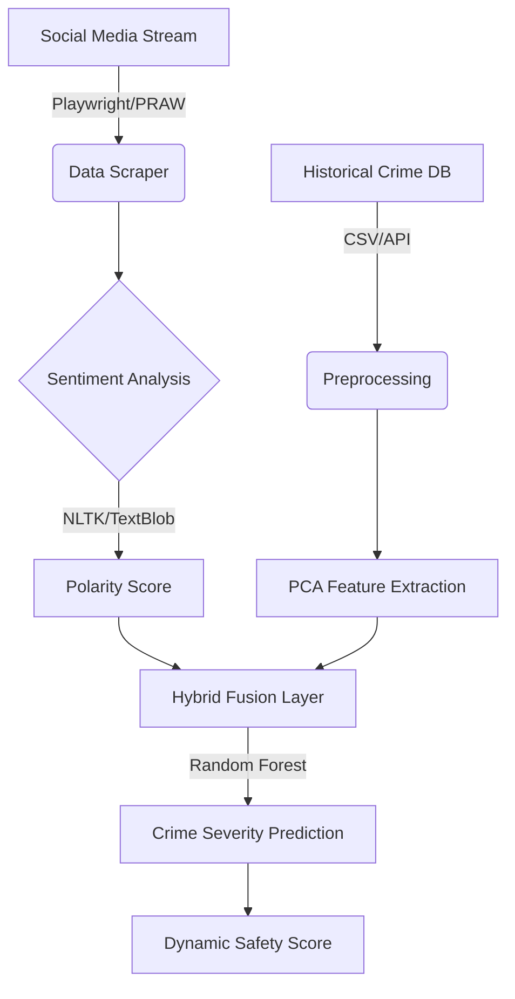

# 📊 Crime Prediction: Sentiment & Historical Hybrid Model
### Enhancing Public Safety with Real-Time Social Insights

*A hybrid predictive system integrating **20GB+ of social media data** with historical crime records to mitigate bias and enable dynamic threat assessment.*

• [Read the Report](team010report.pdf)

---

## 📖 Overview

Traditional crime prediction models (like PredPol) rely heavily on historical hotspot mapping. While effective, these models suffer from **feedback loop bias**—over-policed areas generate more data, leading to more policing. Furthermore, they are **static**, failing to account for real-time social unrest.

This project introduces a **Hybrid Predictive Model** that synthesizes:
1.  **Historical Data:** Long-term crime trends (FBI/State records).
2.  **Real-Time Sentiment:** Dynamic social signals from Twitter (X) and Reddit.

[cite_start]By weighing public sentiment alongside crime statistics, we achieved an **87% accuracy** in assessing crime severity, providing a more holistic view of public safety[cite: 78, 102].

---

## 🏗️ System Architecture

The pipeline processes unstructured social data and structured government records to generate a "Safety Score" for specific regions.

## 📊 Key Features & Methodology

### 1. Data Acquisition (20GB+)
* **Twitter:** Scraped 10,000+ localized tweets using **Playwright** to bypass API limitations.
* **Reddit:** Extracted discussion threads using **PRAW** to capture community sentiment.
* **Historical:** Aggregated state-level crime datasets (California, Illinois, NY, Texas, Washington).

### 2. The "Severity Scoring" Algorithm
We developed a custom weighted formula to quantify danger.
* **High Impact (Weight 8-10):** Homicide, Sexual Assault, Kidnapping.
* **Medium Impact (Weight 5-8):** Robbery, Burglary.
* **Low Impact (Weight 3-5):** Fraud, Petty Theft.

### 3. Machine Learning Integration
* **Dimensionality Reduction:** Applied **PCA (Principal Component Analysis)** to reduce noise in historical datasets.
* **Classification:** Used **Random Forest** to predict severity trends based on the fused dataset.

---

## 📈 Performance & Results

The model was evaluated on a custom testbed of **5 Major US States**, comparing our "Hybrid Score" against standard indexes (e.g., Numbeo, US News).

| State | Historical Score | Sentiment Score | **Hybrid Severity Score** |
| :--- | :---: | :---: | :---: |
| **California** | 8.07 | 8.56 | **8.31** |
| **New York** | 7.26 | 8.32 | **7.79** |
| **Texas** | 7.68 | 8.09 | **7.88** |
| **Illinois** | 7.85 | 8.48 | **8.16** |

> **💡 Key Insight:** The integration of sentiment analysis revealed higher **"perceived danger"** in areas like New York compared to their raw historical stats, highlighting the disconnect between reported crime and public feeling.

---

## 🛠️ Tech Stack

| Component | Technology | Utility |
| :--- | :--- | :--- |
| **Scraping** | `Playwright`, `PRAW` | Headless browsing & API interaction |
| **NLP** | `NLTK`, `TextBlob` | Tokenization, Polarity Analysis, Stop-word removal |
| **ML Core** | `Scikit-Learn` | PCA, Random Forest, Feature Scaling |
| **Data Processing** | `Pandas`, `Hashlib` | Dataframe manipulation, Duplicate hashing |
| **Concurrency** | `Asyncio` | Efficient parallel data fetching |

---
*University at Buffalo | EAS 508: Data Science*
